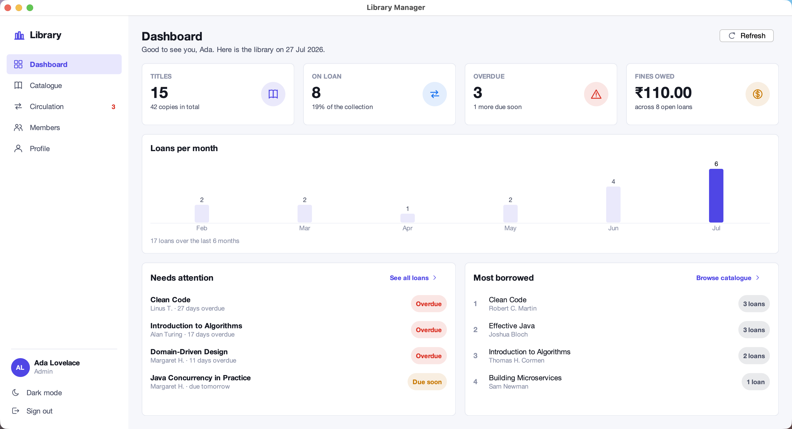
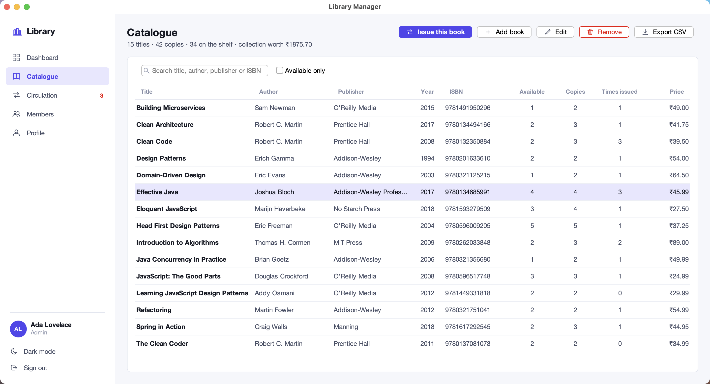
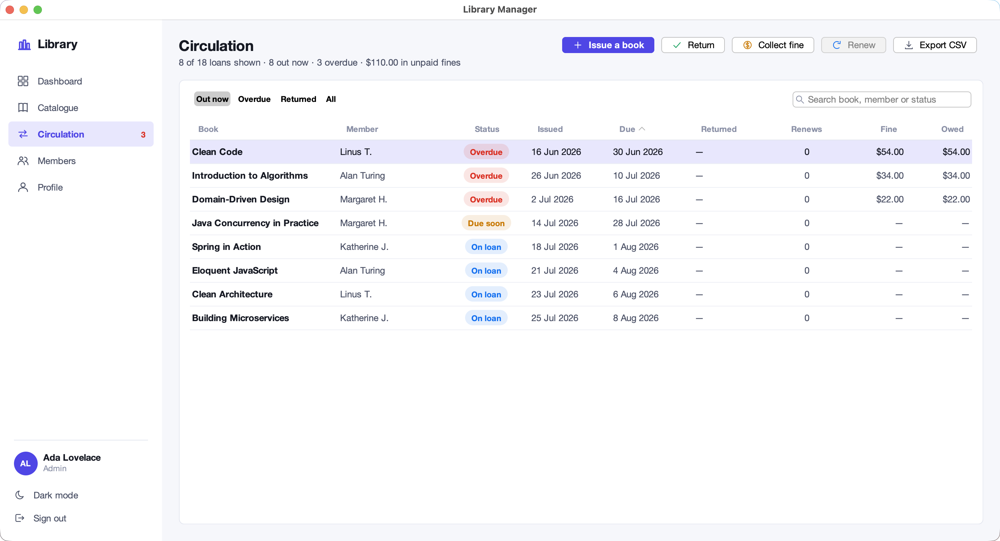
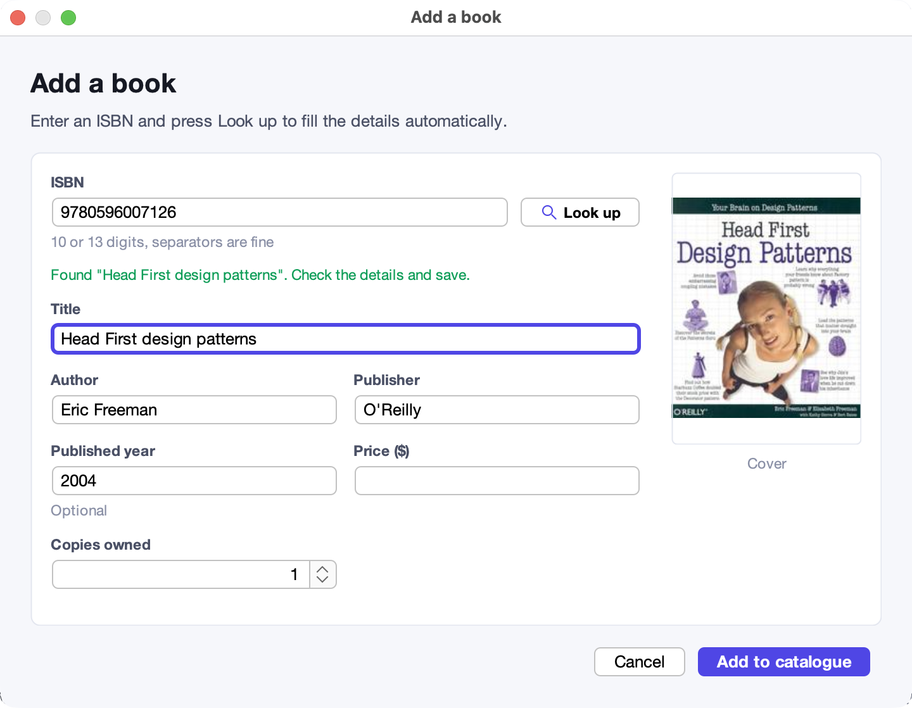
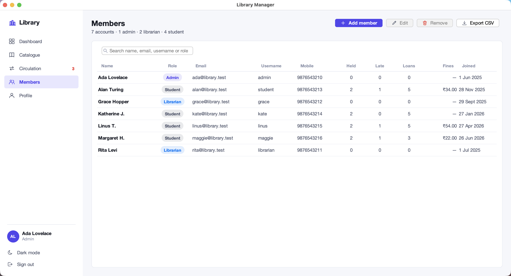
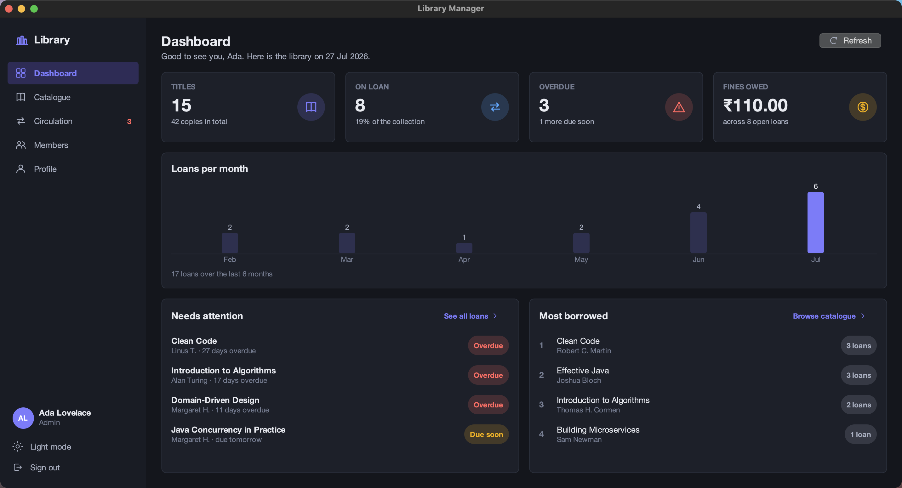
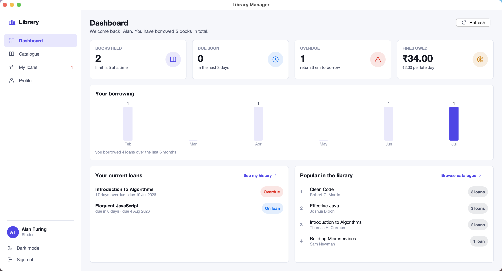
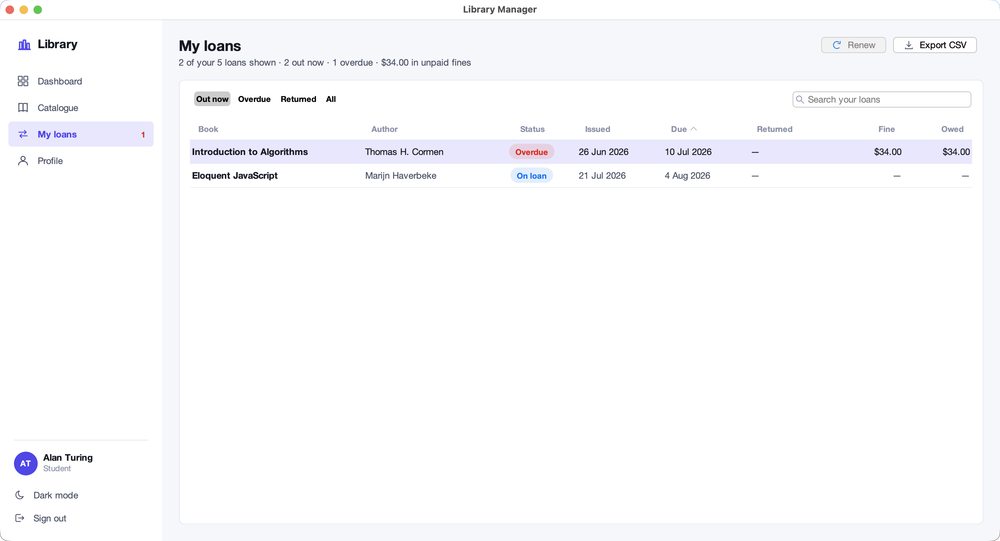
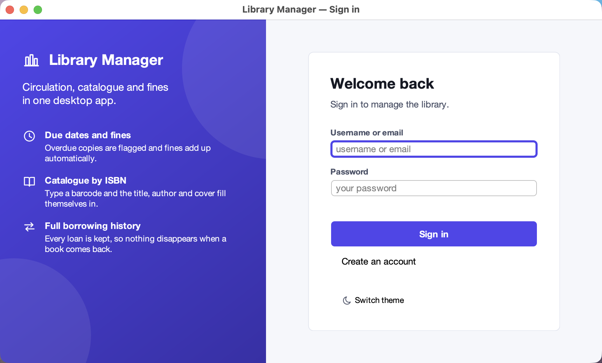

<div align="center">


# Library Manager

[](LICENSE) [](https://github.com/kaushalmeena/library-manager/actions) [](https://openjdk.org/) [](https://www.sqlite.org/) [](https://maven.apache.org/)

**A desktop library system that tracks due dates, fines and every loan ever made.**

A Java desktop application for running a small library. It catalogues books by
**ISBN lookup**, issues and returns copies against a **14-day loan period**,
accrues fines on overdue items, and keeps a permanent **borrowing history** —
all stored in a local SQLite file with no server to set up.

</div>

---

## Screenshots

<table>
  <tr>
    <td width="50%"></td>
    <td width="50%"></td>
  </tr>
</table>

<details>
<summary>More screenshots</summary>

<table>
  <tr>
    <td width="50%"></td>
    <td width="50%"></td>
  </tr>
  <tr>
    <td width="50%"></td>
    <td width="50%"></td>
  </tr>
  <tr>
    <td width="50%"></td>
    <td width="50%"></td>
  </tr>
  <tr>
    <td width="50%"></td>
    <td width="50%"></td>
  </tr>
</table>

</details>

## Features

- **Catalogue by ISBN** — type a barcode, press Look up, and the title, author,
  publisher, year and cover art arrive from [Open Library](https://openlibrary.org/)
  with no API key and no retyping.
- **Due dates and fines** — every loan gets a due date, overdue copies are
  flagged in red, and fines accrue per late day until the book is returned or
  the fine is settled at the desk.
- **Permanent borrowing history** — returning a book closes its loan instead of
  deleting it, so the library keeps a full record of who borrowed what and when.
- **Live availability** — how many copies are on the shelf is derived from open
  loans rather than stored as a counter, so it can never drift out of step.
- **Renewals and lending rules** — loans can be renewed twice; borrowing is
  blocked past the per-member limit or while anything is overdue.
- **Role-based access** — admins manage accounts, librarians run the desk, and
  students see only their own loans and fines.
- **Dashboards worth reading** — live totals, a six-month loan chart, a
  most-borrowed leaderboard, and a needs-attention list of overdue items.
- **Search, sort and export** — every table filters as you type, sorts on any
  column, and exports what is on screen to CSV.
- **Light and dark themes** — a modern flat interface that remembers which mode
  you last used.

## How It Works

1. **Sign in** — accounts are stored with bcrypt-hashed passwords; the role on
   the account decides which screens appear in the sidebar.
2. **Catalogue a book** — enter an ISBN and the details are fetched in the
   background, so a slow network never freezes the window.
3. **Issue a copy** — pick the book and the member from searchable pickers. The
   dialog shows the resulting due date and any rule that would block the loan
   before you commit.
4. **Track what is out** — availability, overdue counts and fines are all
   derived from the loans table, so the dashboard and catalogue always agree.
5. **Take it back** — a return stamps the return date and settles any fine,
   leaving the loan in place as history.

> All data lives in a single SQLite file under `~/.library-manager/`. The only
> network request the application ever makes is the optional ISBN lookup.

## Tech Stack

| Area          | Tools                                                                                                     |
| ------------- | --------------------------------------------------------------------------------------------------------- |
| **Language**  | [Java 17](https://openjdk.org/projects/jdk/17/) (records, sealed switches, text blocks)                    |
| **UI**        | [Swing](https://docs.oracle.com/javase/tutorial/uiswing/) · [FlatLaf](https://www.formdev.com/flatlaf/) (flat light & dark themes) |
| **Storage**   | [SQLite](https://www.sqlite.org/) via [sqlite-jdbc](https://github.com/xerial/sqlite-jdbc)                 |
| **Security**  | [jBCrypt](https://github.com/jeremyh/jBCrypt) (password hashing)                                          |
| **Data**      | [Open Library API](https://openlibrary.org/dev/docs/api/books) · [Gson](https://github.com/google/gson)    |
| **Testing**   | [JUnit 5](https://junit.org/junit5/) (118 tests over an in-memory database)                                |
| **Build**     | [Maven](https://maven.apache.org/) (wrapper committed) · [GitHub Actions](.github/workflows/build.yml)     |

## Getting Started

These instructions will get you a copy of the project up and running on your
local machine for development purposes.

### Requirements

To install and run this project you need:

- [Java Development Kit](https://adoptium.net/) 17 or newer
- [git](https://git-scm.com/downloads) (only to clone this repository)

Maven itself is **not** required — the repository ships the Maven Wrapper, which
downloads the right version on first use.

### Installation

To set up everything on your local machine, follow these steps:

1. Clone this repo and then change directory to the `library-manager` folder:

```bash
git clone https://github.com/kaushalmeena/library-manager.git
cd library-manager
```

2. Download the dependencies and compile the project:

```bash
./mvnw verify
```

On Windows use `mvnw.cmd` in place of `./mvnw` throughout.

### Running

To launch the application from source:

```bash
./mvnw exec:java
```

The first run creates and seeds `~/.library-manager/library.db`, then signs you
in with the demo administrator account:

| Username    | Password      | Role      |
| ----------- | ------------- | --------- |
| `admin`     | `password123` | Admin     |
| `librarian` | `password123` | Librarian |
| `student`   | `password123` | Student   |

Library policy can be changed without a rebuild, for example a one-week loan
with a higher fine:

```bash
./mvnw exec:java -Dlibrary.loanDays=7 -Dlibrary.finePerDay=5.00
```

To start over with an empty library, delete the data directory:

```bash
rm -rf ~/.library-manager
```

### Testing

To run the unit tests:

```bash
./mvnw test
```

The suite runs against a throw-away in-memory database and makes no network
requests, so it is safe to run offline.

### Building

To build a self-contained runnable jar:

```bash
./mvnw package
```

The jar is written to `target/library-manager.jar` and bundles every dependency,
so it runs anywhere a JDK 17 is installed:

```bash
java -jar target/library-manager.jar
```

## Credits

- Book metadata and cover art from the
  [Open Library API](https://openlibrary.org/dev/docs/api/books), by the
  **Internet Archive**, free to use.
- [FlatLaf](https://www.formdev.com/flatlaf/) by **FormDev Software**, licensed
  under [Apache 2.0](https://github.com/JFormDesigner/FlatLaf/blob/main/LICENSE).

## License

This project is licensed under the MIT License — see the [LICENSE](LICENSE)
file for details.
