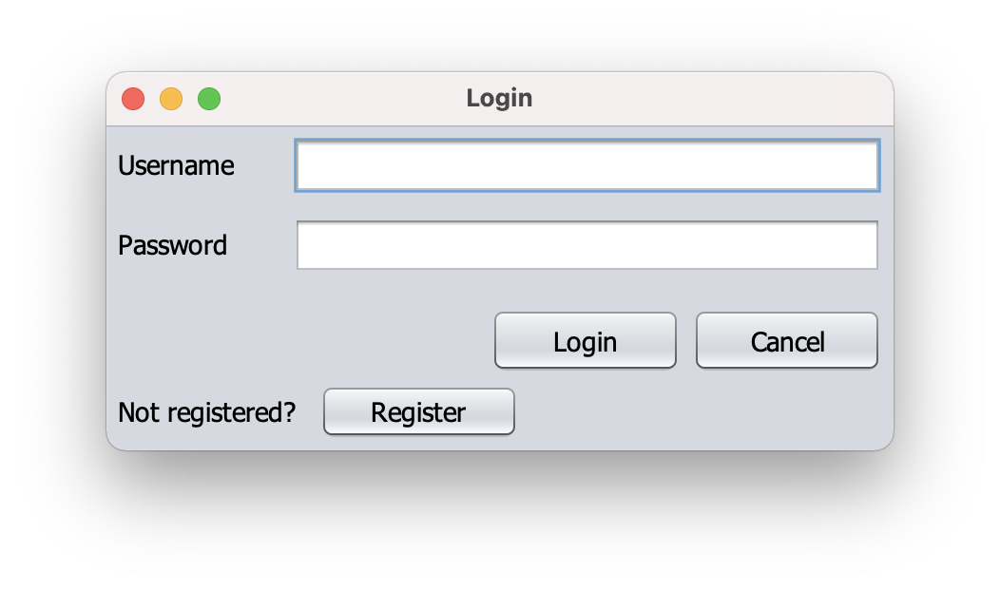
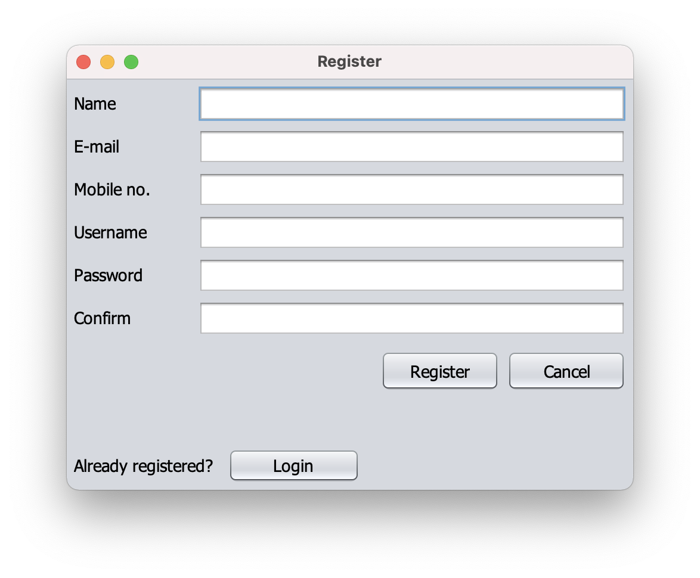
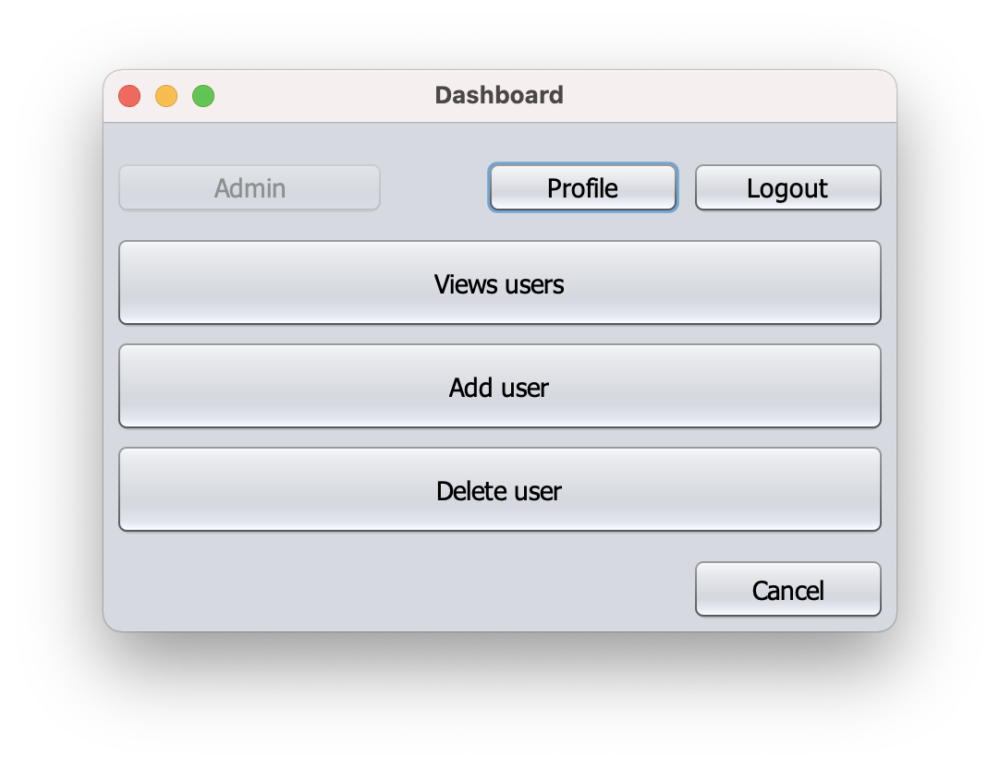
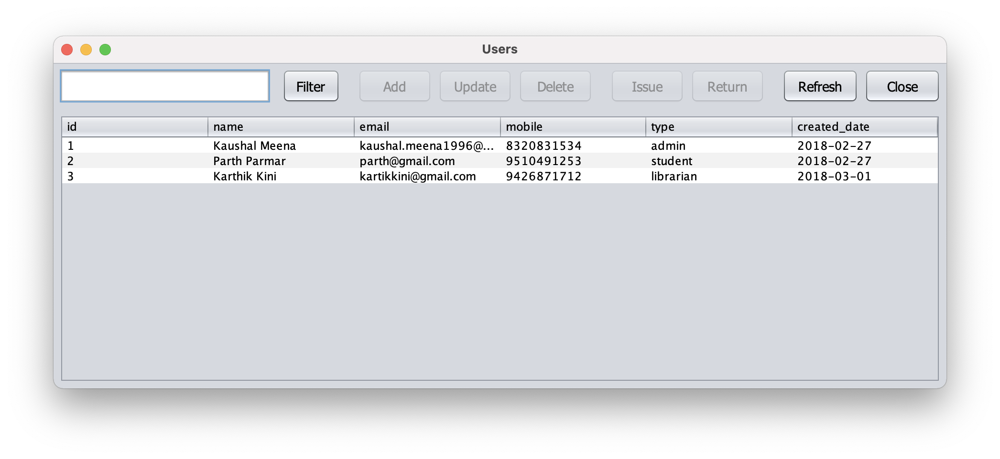
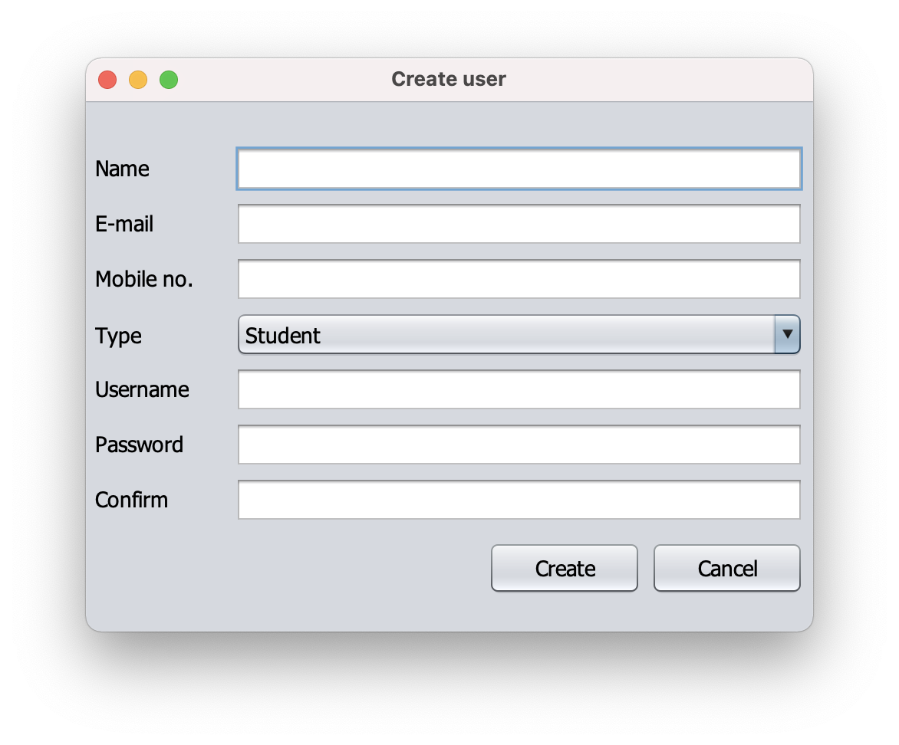
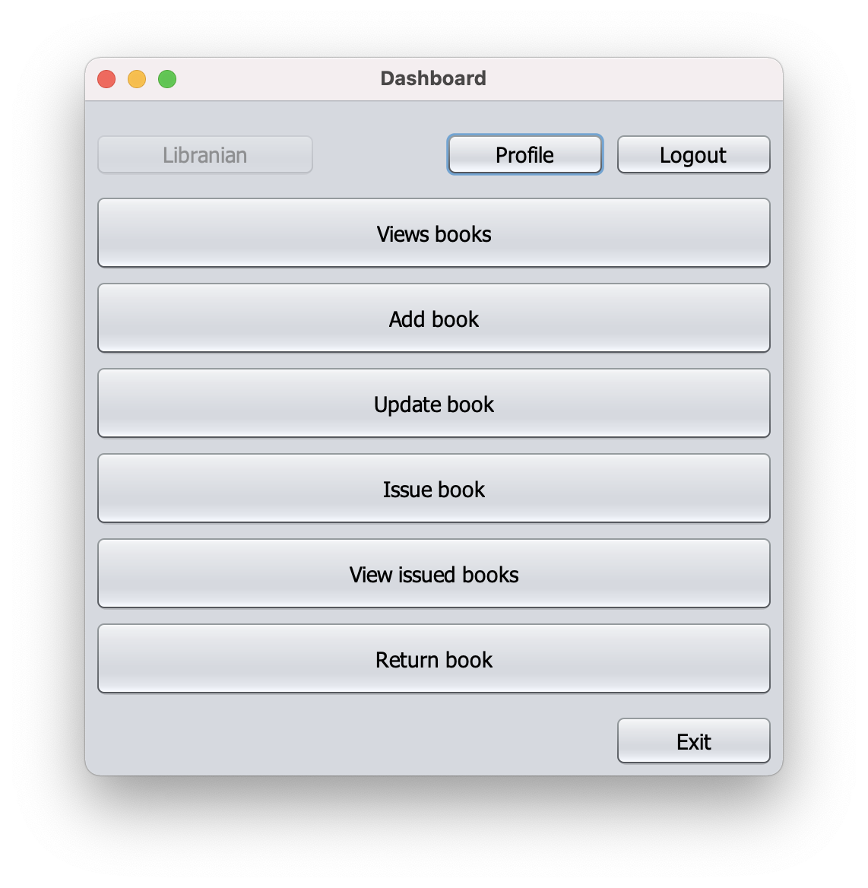
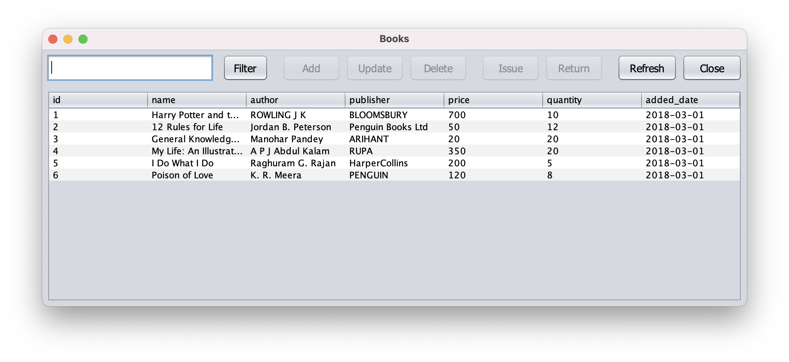
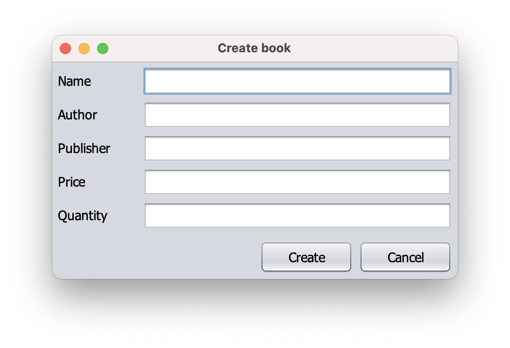
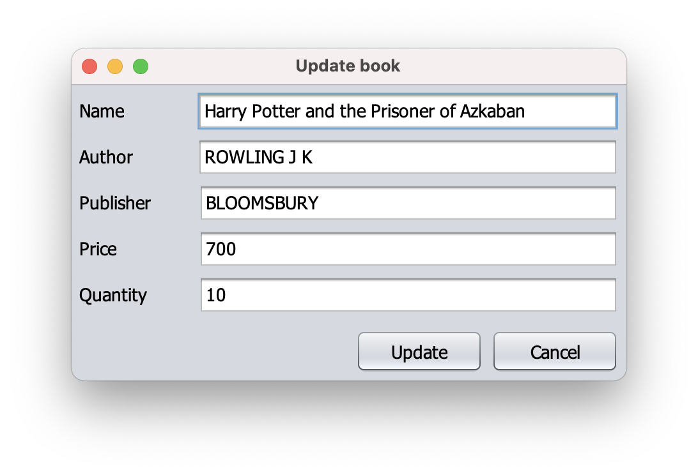
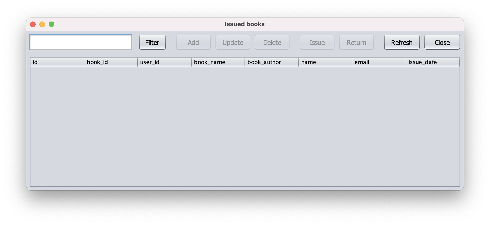

<div align="center">

# Library Manager

[](LICENSE) [](https://www.oracle.com/java/) [](https://www.sqlite.org/) [](https://netbeans.apache.org/)

**A Java desktop application for managing a library with role-based access.**

A NetBeans project for library management that stores data in an **SQLite**
database, with separate modules for authentication, admin, librarian, and
student workflows.

</div>

---

## Screenshots

<table>
  <tr><th colspan="2"><h3>Auth Module</h3></th></tr>
  <tr>
    <td align="center"><strong>Login</strong><br></td>
    <td align="center"><strong>Register</strong><br></td>
  </tr>
  <tr><th colspan="2"><h3>Student Module</h3></th></tr>
  <tr>
    <td align="center" colspan="2"><strong>Dashboard</strong><br></td>
  </tr>
</table>

<details>
<summary>More screenshots (Admin & Librarian)</summary>

<table>
  <tr><th colspan="2"><h3>Admin Module</h3></th></tr>
  <tr>
    <td align="center"><strong>Dashboard</strong><br></td>
    <td align="center"><strong>Manage Users</strong><br></td>
  </tr>
  <tr>
    <td align="center" colspan="2"><strong>Create User</strong><br></td>
  </tr>
  <tr><th colspan="2"><h3>Librarian Module</h3></th></tr>
  <tr>
    <td align="center"><strong>Dashboard</strong><br></td>
    <td align="center"><strong>Books</strong><br></td>
  </tr>
  <tr>
    <td align="center"><strong>Create Book</strong><br></td>
    <td align="center"><strong>Update Book</strong><br></td>
  </tr>
  <tr>
    <td align="center" colspan="2"><strong>Issued Books</strong><br></td>
  </tr>
</table>

</details>

## Features

- **Role-based access** — separate modules for Admin, Librarian, and Student
  roles.
- **Authentication** — login and registration system with role assignment.
- **Book management** — create, update, and track library books.
- **Issue tracking** — manage book issues and returns per student.
- **SQLite storage** — lightweight embedded database with no server setup
  required.

## Tech Stack

| Area          | Tools                                                                 |
| ------------- | --------------------------------------------------------------------- |
| **Language**  | [Java SE 12](https://www.oracle.com/java/technologies/javase/jdk12-archive-downloads.html) |
| **Database**  | [SQLite](https://www.sqlite.org/)                                     |
| **IDE**       | [NetBeans 12](https://netbeans.apache.org/)                           |
| **Build**     | [Maven](https://maven.apache.org/) (via `pom.xml`)                    |

## Getting Started

These instructions will get you a copy of the project up and running on your
local machine for development purposes.

### Requirements

To install this project you need:

- [NetBeans 12](https://netbeans.apache.org/download/nb120/nb120.html)
- [Java SE Development Kit 12](https://www.oracle.com/in/java/technologies/javase/jdk12-archive-downloads.html)
- [git](https://git-scm.com/downloads) (only to clone this repository)

### Installation

To set up everything on your local machine, follow these steps:

1. Clone this repo onto your computer:

```bash
git clone https://github.com/kaushalmeena/library-manager.git
```

2. Open NetBeans and click on **File > Open Project**.

3. Navigate to the `library-manager` folder and press **Open Project**.

## Contributing

Contributions are welcome! If you find a bug or have a feature request, please
[open an issue](https://github.com/kaushalmeena/library-manager/issues/new/choose)
first to discuss it. For code changes, fork the repository, create a branch,
and open a pull request.

## License

This project is licensed under the MIT License — see the [LICENSE](LICENSE)
file for details.
